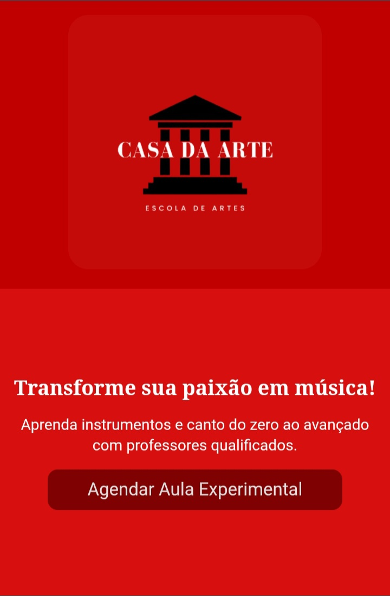

  #  Casa da Arte - Site Institucional

## 📖 Sobre o Projeto

O **Casa da Arte** é um site institucional desenvolvido para uma escola de música e artes, com o objetivo de fortalecer sua presença digital e torná-la mais acessível na internet.

O projeto foi criado para que novas pessoas possam conhecer a escola, visualizar informações importantes e entrar em contato de forma simples e rápida.

---

## 🚀 Tecnologias Utilizadas

  
  
  
  
  
  
  

---

## ✨ Funcionalidades

- Página inicial moderna e responsiva
- Apresentação da escola
- Divulgação dos cursos
- Botão para agendamento de aula experimental
- Interface simples, acessível e intuitiva

---

##  Objetivo

Desenvolver uma plataforma online para aumentar a visibilidade da escola na internet, permitindo que mais pessoas conheçam os cursos e a proposta da Casa da Arte.

---

## 👨‍💻 Desenvolvido por

**Wilson Oliveira**  
🚀 Desenvolvedor Web e Mobile